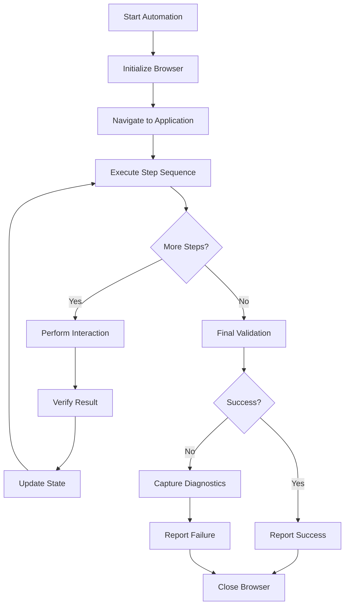

# Web Automation Agent

## Overview

The Web Automation Agent is a general-purpose orchestrator for complex web automation scenarios. It coordinates multiple browser actions, manages state across pages, and handles multi-step workflows.

## When to Use This Agent

Use this agent when you need to:

- Execute multi-page workflows (e.g., registration → confirmation → dashboard)
- Coordinate complex sequences of interactions
- Handle state management across steps
- Manage error recovery and retries
- Validate business outcomes (not just UI states)

## Agent Capabilities

### 1. **Workflow Orchestration**

```javascript
// The agent understands and can execute complex workflows:
// 1. Navigate to application
// 2. Fill multi-step form
// 3. Submit and confirm
// 4. Verify success across pages
```

### 2. **Multi-Tab/Window Management**

```javascript
// Handle scenarios with multiple windows:
// - Open confirmation link in new tab
// - Switch between tabs
// - Verify data consistency
```

### 3. **State Management**

```javascript
// Track state across interactions:
// - Store values for later verification
// - Compare before/after states
// - Validate side effects
```

### 4. **Error Recovery**

```javascript
// Intelligently handle failures:
// - Retry on transient errors
// - Fall back to alternative flows
// - Capture diagnostics on failure
```

### 5. **Complex Validations**

```javascript
// Verify business logic outcomes:
// - Check data consistency across pages
// - Validate background operations
// - Cross-browser state verification
```

## Example Use Cases

### Use Case 1: E-Commerce Purchase Flow

```javascript
// Agent handles entire purchase workflow:
// 1. Browse products
// 2. Add to cart
// 3. Checkout (multi-step form)
// 4. Payment processing
// 5. Order confirmation
// 6. Verify email notification

async function purchaseFlow() {
  const browser = new WebBrowser()
  try {
    await browser.start()

    // Step 1: Browse
    await browser.goto('https://shop.example.com')
    await browser.link('Electronics').click()

    // Step 2: Add to cart
    await browser.button('Add to Cart').within.element('product-card').click()

    // Step 3: Checkout
    await browser.button('Proceed to Checkout').click()

    // Multi-step checkout form
    await browser.textbox('Email').write('user@example.com')
    await browser.button('Continue').click()

    await browser.textbox('Address').write('123 Main St')
    await browser.button('Continue').click()

    // Step 4: Payment
    await browser.textbox('Card Number').write('4111111111111111')
    await browser.button('Complete Purchase').click()

    // Step 5: Confirmation
    await browser.heading('Order Confirmed').should.be.visible()
    const orderNumber = await browser.element('order-number').get.text()

    // Step 6: Verify
    console.log(`✅ Order placed: ${orderNumber}`)
  } finally {
    await browser.close()
  }
}
```

### Use Case 2: API + UI Coordination

```javascript
// Agent coordinates API verification with UI actions:
async function verifyDataSync() {
  const browser = new WebBrowser()

  try {
    await browser.start()
    await browser.goto('https://app.example.com/dashboard')

    // Perform action via UI
    await browser.textbox('Goal Amount').write('5000')
    await browser.button('Save').click()

    // Verify UI shows update
    await browser.paragraph('Goal: $5000').should.be.visible()

    // Verify API has update (with external API call)
    const apiResponse = await fetch('/api/goals')
    const data = await apiResponse.json()
    console.assert(data.goal === 5000, 'API has correct data')

    console.log('✅ Data sync verified')
  } finally {
    await browser.close()
  }
}
```

### Use Case 3: Multi-Tab Coordination

```javascript
// Agent handles interactions across multiple tabs:
async function multiTabFlow() {
  const browser = new WebBrowser()

  try {
    await browser.start()
    await browser.goto('https://app.example.com')

    // Open settings in new tab
    await browser.link('Settings').rightClick() // or open via menu

    const tabs = await browser.getTabs()
    await browser.switchToTab(1) // Switch to new tab

    // Make changes in new tab
    await browser.textbox('Theme').selectByText('Dark')
    await browser.button('Save').click()

    // Go back to first tab
    await browser.switchToTab(0)

    // Verify changes are reflected
    await browser.element('body').getCssValue('background-color')

    console.log('✅ Settings applied across tabs')
  } finally {
    await browser.close()
  }
}
```

## Skills Utilized by This Agent

- **Browser Control** - Session management, tab/window coordination
- **Element Finding** - Locate elements with context
- **Element Interactions** - Perform complex sequences
- **Form Handling** - Multi-step form submission
- **Cross-Browser Config** - Run on different browsers

## Agent Workflow



## Common Patterns

### Pattern 1: Multi-Step with Validation at Each Step

```javascript
async function stepByStepFlow() {
  await browser.start()

  try {
    // Step 1
    await browser.action()
    await browser.verification().should.be.visible()

    // Step 2
    await browser.nextAction()
    await browser.nextVerification().should.be.visible()

    // Step 3
    await browser.finalAction()
    await browser.finalVerification().should.be.visible()

    console.log('✅ All steps completed successfully')
  } catch (error) {
    console.error('❌ Workflow failed:', error.message)
    throw error
  } finally {
    await browser.close()
  }
}
```

### Pattern 2: State Tracking Across Steps

```javascript
async function trackStateFlow() {
  const state = {}

  await browser.start()

  try {
    // Step 1: Capture initial state
    state.initial = await browser.element('counter').get.text()

    // Step 2: Perform action
    await browser.button('Increment').click()

    // Step 3: Verify state changed
    state.after = await browser.element('counter').get.text()
    console.assert(state.after > state.initial, 'State updated')

    console.log(`✅ State changed from ${state.initial} to ${state.after}`)
  } finally {
    await browser.close()
  }
}
```

### Pattern 3: Conditional Flow

```javascript
async function conditionalFlow() {
  await browser.start()

  try {
    const userType = await browser.element('user-type').get.text()

    if (userType === 'Premium') {
      // Premium user path
      await browser.button('Premium Feature').click()
    } else {
      // Free user path
      await browser.button('Upgrade').click()
    }

    // Common verification
    await browser.heading('Success').should.be.visible()

    console.log(`✅ ${userType} flow completed`)
  } finally {
    await browser.close()
  }
}
```

## Error Handling Strategy

```javascript
async function robustFlow() {
  const browser = new WebBrowser()
  const maxRetries = 3

  for (let attempt = 1; attempt <= maxRetries; attempt++) {
    try {
      await browser.start()

      // Perform actions
      await browser.goto('https://app.example.com')
      await browser.button('Action').click()
      await browser.verification().should.be.visible()

      console.log('✅ Success on attempt', attempt)
      break
    } catch (error) {
      console.log(`❌ Attempt ${attempt} failed:`, error.message)

      if (attempt === maxRetries) {
        throw new Error(`Failed after ${maxRetries} attempts`)
      }

      // Cleanup before retry
      try {
        await browser.close()
      } catch (e) {
        // Ignore close errors
      }

      // Wait before retry
      await new Promise((resolve) => setTimeout(resolve, 2000))
    }
  }
}
```

## Integration Points

### With Form Filler Agent

Use when form filling is complex or needs validation:

```javascript
// Web Automation Agent orchestrates
await formFillerAgent.fillForm('registration-form')
await webAutomationAgent.verifySubmission()
```

### With Element Inspector Agent

Use when element finding is complex:

```javascript
// Find complex elements
const element = await elementInspectorAgent.findElement('by-spatial-context')
// Web Automation Agent uses it
await webAutomationAgent.interactWith(element)
```

### With Test Automation Agent

Use for test scenario execution:

```javascript
// Test Automation Agent defines scenario
// Web Automation Agent executes it
const result = await webAutomationAgent.executeScenario(scenario)
```

## Best Practices

1. **Break into smaller steps** - Easier to debug and maintain
2. **Verify after each action** - Catch issues early
3. **Track state explicitly** - Use variables for values needed later
4. **Handle errors gracefully** - Cleanup resources, provide diagnostics
5. **Use meaningful assertions** - Clear error messages
6. **Consider timeouts** - Adjust for slow operations
7. **Test multiple browsers** - Run on Chrome, Firefox, Safari

## Related Agents

- **Form Filler Agent** - Specialized in complex form handling
- **Element Inspector Agent** - Specialized in element location
- **Test Automation Agent** - Specialized in test scenario execution

## See Also

- [Copilot Instructions](copilot-instructions.md) - Framework overview
- [Browser Control Skill](../app/browser/.instructions.md) - Session management
- [Element Interactions Skill](../app/command-delegates/.instructions.md) - Interaction methods
