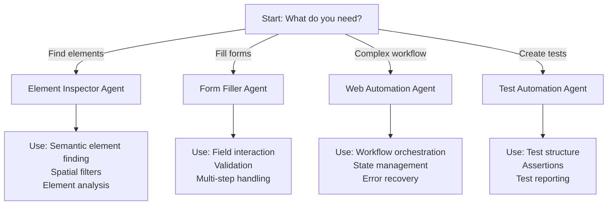

# Agent Directory

This document lists all available agents for automating actions on websites using the WebBrowser framework. Each agent is specialized for specific automation scenarios.

## Quick Reference

| Agent                 | Specialization       | When to Use                             | Key Skills                          |
| --------------------- | -------------------- | --------------------------------------- | ----------------------------------- |
| **Web Automation**    | Multi-step workflows | Complex user journeys, multi-page flows | Orchestration, state management     |
| **Form Filler**       | Form operations      | Fill, validate, submit forms            | Field interaction, validation       |
| **Element Inspector** | Element finding      | Debug element location                  | Semantic selection, spatial filters |
| **Test Automation**   | Test scenarios       | Create and run tests                    | Test structure, assertions          |

---

## 1. Web Automation Agent

**File**: [web-automation.agent.md](web-automation.agent.md)

### Overview

General-purpose orchestrator for complex web automation scenarios across multiple pages and interactions.

### Specialization

- Multi-step workflows
- Workflow coordination
- Cross-page interactions
- State management
- Error recovery

### Example Scenarios

- E-commerce purchase flow (browse → cart → checkout → confirmation)
- API + UI coordination
- Multi-tab operations
- Complex user journeys

### When to Use

- Need to automate a complete workflow
- Coordinating multiple browser actions
- Managing state across steps
- Handling error recovery and retries

### Related

- [Form Filler Agent](form-filler.agent.md) - For complex form filling within workflow
- [Element Inspector Agent](element-inspector.agent.md) - For finding complex elements
- [Test Automation Agent](test-automation.agent.md) - For validating workflow outcomes

---

## 2. Form Filler Agent

**File**: [form-filler.agent.md](form-filler.agent.md)

### Overview

Specialized for form operations: filling, validation, and submission with intelligent field handling.

### Specialization

- Multi-field form filling
- Complex field types (dropdown, checkbox, radio, slider)
- Form validation and error handling
- Multi-step forms
- Conditional field filling

### Example Scenarios

- Registration forms with validation
- Checkout forms with multiple steps
- Survey forms with conditional fields
- Complex data entry forms

### When to Use

- Need to fill complete forms
- Handle complex field dependencies
- Validate form before submission
- Correct form errors and retry

### Related

- [Web Automation Agent](web-automation.agent.md) - For orchestrating form within workflow
- [Element Inspector Agent](element-inspector.agent.md) - For finding form elements
- [Test Automation Agent](test-automation.agent.md) - For testing form scenarios

---

## 3. Element Inspector Agent

**File**: [element-inspector.agent.md](element-inspector.agent.md)

### Overview

Specialized for finding and analyzing page elements with debugging support.

### Specialization

- Semantic element location
- Spatial context application
- Element analysis and properties
- Debugging element finding issues
- Element relationship mapping

### Example Scenarios

- Finding complex elements with spatial filters
- Analyzing element state and properties
- Debugging why elements can't be found
- Generating element selectors
- Mapping element relationships

### When to Use

- Need to locate complex elements
- Debug element finding failures
- Analyze element structure
- Validate element state before interaction

### Related

- [Web Automation Agent](web-automation.agent.md) - For using found elements
- [Form Filler Agent](form-filler.agent.md) - For analyzing form fields
- [Test Automation Agent](test-automation.agent.md) - For element validation in tests

---

## 4. Test Automation Agent

**File**: [test-automation.agent.md](test-automation.agent.md)

### Overview

Specialized for creating and executing test scenarios with assertions and reporting.

### Specialization

- Test scenario definition
- Assertion management
- Test organization and execution
- Test reporting
- Error handling and failure debugging

### Example Scenarios

- User registration testing
- Multi-step test workflows
- Data-driven tests
- Accessibility testing
- Cross-browser testing

### When to Use

- Need to create test scenarios
- Validate application behavior
- Generate test reports
- Debug test failures
- Ensure code quality through testing

### Related

- [Web Automation Agent](web-automation.agent.md) - For executing test workflows
- [Form Filler Agent](form-filler.agent.md) - For testing form scenarios
- [Element Inspector Agent](element-inspector.agent.md) - For verifying elements in tests

---

## Agent Selection Guide

---

## Best Practices for Agent Usage

1. **Choose the right agent** - Match agent specialization to your task
2. **Use agents in combination** - Each handles its specialty
3. **Start with inspection** - Element Inspector validates element finding
4. **Then fill/interact** - Form Filler or Element Interactions
5. **Orchestrate if complex** - Web Automation coordinates multi-step workflows
6. **Always test** - Test Automation validates outcomes
7. **Document assumptions** - Comment why specific agent was chosen

---

## Next Steps

1. **Review Framework Instructions**: [Copilot Instructions](copilot-instructions.md)
2. **Choose Your Agent**: See the table above and links below
3. **Explore Skills**: Each agent uses specific skills documented in `../app/*/` directories
4. **Start Building**: Create automation scripts using appropriate agents

---

## Agent Documentation Links

- [Web Automation Agent](web-automation.agent.md) - Orchestrator for complex workflows
- [Form Filler Agent](form-filler.agent.md) - Specialized form operations
- [Element Inspector Agent](element-inspector.agent.md) - Element finding and analysis
- [Test Automation Agent](test-automation.agent.md) - Test creation and execution

---

## See Also

- [Main Framework Instructions](copilot-instructions.md) - Framework overview
- [Tools Manifest](tools-manifest.md) - Complete API reference
